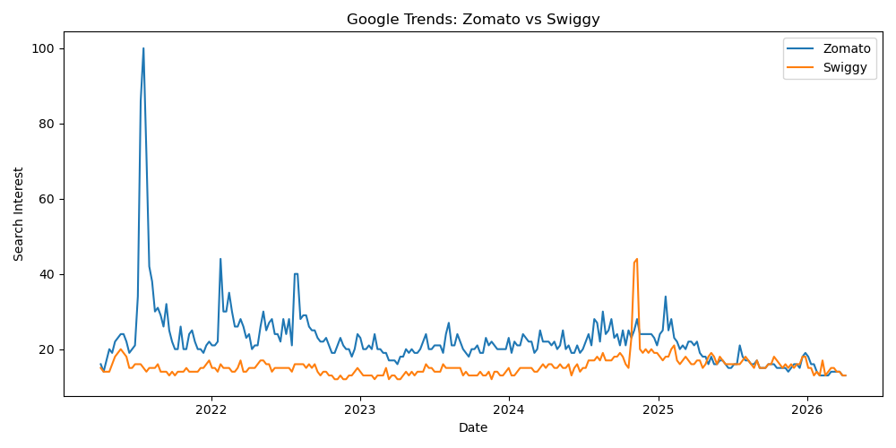
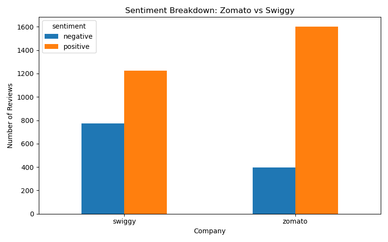
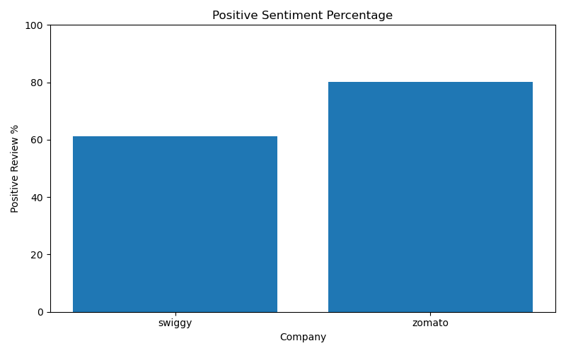
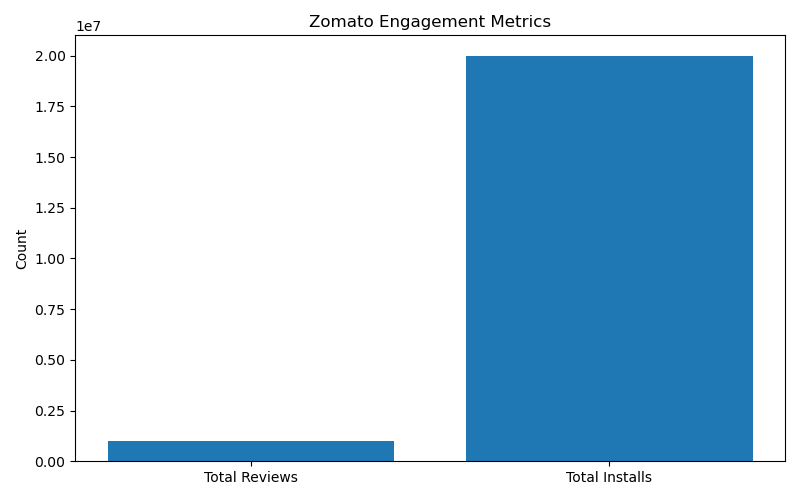
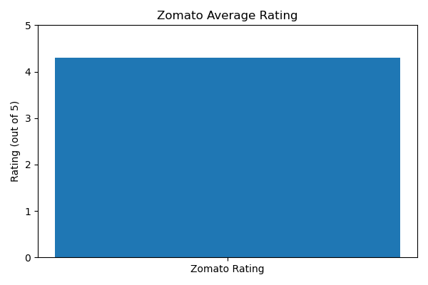

# 🚀 Alternative Data Analysis: Zomato vs Swiggy

> 📊 A data-driven comparison of Zomato and Swiggy using alternative data signals  
> ⚡ Built to simulate real-world data product workflows (YipitData-style)

---

## 🧠 Problem Statement

Traditional financial metrics don’t always capture real-time business performance.

This project answers:

> ❓ *Which company is actually performing better — Zomato or Swiggy — based on real user behavior and demand signals?*

---

## 🔍 Approach

Instead of relying on financial reports, this project uses:

| Data Source | Purpose |
|------------|--------|
| 📱 Play Store Data | Product strength (installs, ratings, engagement) |
| 📈 Google Trends | Market demand & search interest |
| 💬 Live Reviews (4000+) | Customer sentiment |

---

## ⚙️ Pipeline Overview

Raw Data → Cleaning → Validation → Multi-source Analysis → Insights → Visuals

## 📊 Visual Insights

### 📈 Market Demand (Google Trends)

---

### 💬 Customer Sentiment Comparison

---

### 📊 Positive Sentiment %

---

### 📱 Zomato Engagement Metrics

---

### ⭐ Zomato Rating

---

## 🔑 Key Findings

### 📌 Product Strength
- ~20M installs  
- ⭐ 4.3 average rating  
- 💬 1M+ reviews  

👉 Zomato has **strong user adoption & engagement**

---

### 📌 Market Demand
- Zomato vs Swiggy → **equal current interest (13 vs 13)**  
- Both show **slight decline in demand**

---

### 📌 Customer Sentiment (GAME-CHANGER 🔥)

| Company | Positive | Negative | Positive % |
|--------|----------|----------|-----------|
| Zomato | 1603 | 397 | ~80% |
| Swiggy | 1226 | 774 | ~61% |

👉 Zomato users are **significantly more satisfied**

---

## 🧠 Final Insight

Even though:
- Market demand is similar  
- Growth is slightly declining  

👉 **Zomato clearly outperforms Swiggy in customer satisfaction**

### 💡 What this means:
- Stronger **customer experience**
- Better **retention potential**
- More stable **long-term positioning**

---

## 🧩 Real-World Thinking (Why this matters)

This project demonstrates:

✔ Handling **incomplete datasets**  
✔ Validating data before analysis  
✔ Combining multiple data sources  
✔ Turning raw data into **business insights**

👉 This is exactly how **data products for investors** are built.

---

## 🛠 Tech Stack

- 🐍 Python (Pandas)  
- 📊 Matplotlib  
- 📡 Google Trends API (pytrends)  
- 📱 Google Play Scraper  

---

## 📁 Project Structure
data/
raw/
processed/
report/
visuals/
scripts/

---

## 🚀 Future Improvements

- NLP-based sentiment analysis  
- Time-series forecasting  
- Interactive dashboard (Power BI / Streamlit)  
- More alternative data sources  

---

## 👤 Author

**Sinchana SV**

---

## ⭐ If you found this useful

Give this repo a ⭐ and connect with me!
